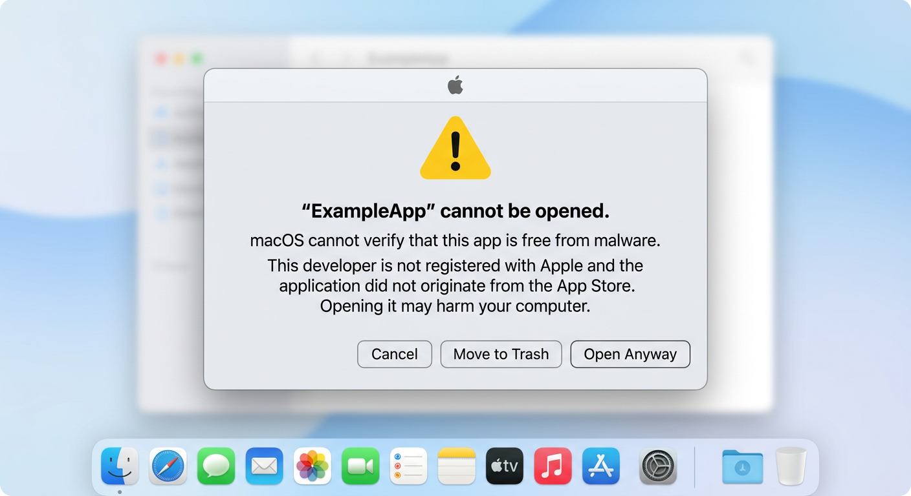
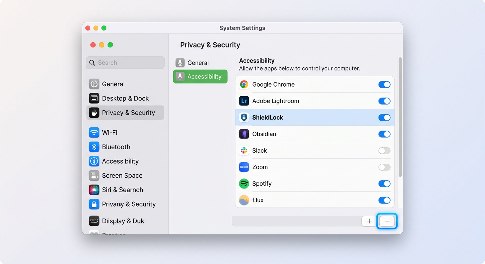

<p align="center">
  
</p>

# ShieldLock

ShieldLock is an open-source, full-screen transparent screen locker for macOS. It is designed for always-on servers (like a MacBook Air server) or presentation/booth laptops where you want the screen content to remain visible, but want to prevent unauthorized application switching, desktop swipes, or system gestures.

## Disclaimer & No Warranty

**CRITICAL: USE AT YOUR OWN RISK.**

ShieldLock is a low-level system utility that intercepts system inputs and restricts macOS system behaviors. 

By using this software, you agree that:
- **No Liability**: The author and contributors of ShieldLock assume **absolutely no responsibility or liability** for any accidental GUI lockouts, system crashes, data loss, or bricked server access.
- **No Warranty**: The software is provided "as is", without warranty of any kind, express or implied, including but not limited to the warranties of merchantability, fitness for a particular purpose, or non-infringement.
- **Buyer Beware**: If you get locked out of your Mac, you are solely responsible for recovering it (e.g., using the remote SSH or local Safe Mode recovery methods detailed below).

## Prerequisites

- macOS 13.0 or later
- Accessibility permissions granted to the application (the app will prompt you with instructions on launch)

## Installation

### 1. Via Homebrew (Recommended)

You can install ShieldLock directly using Homebrew from the official tap:

```bash
brew tap bendechrai/homebrew-tap
brew install --cask shieldlock
```

### 2. Manual Download

Alternatively, you can download the latest pre-compiled `ShieldLock.zip` from the [GitHub Releases](https://github.com/bendechrai/shieldlock/releases) page, extract it, and copy `ShieldLock.app` to your `/Applications` folder.

## How to Use ShieldLock

ShieldLock features intelligent, context-aware launch detection depending on whether it is configured as a login item:

- **Launch on Login (Auto-Lock)**: If "Launch on login" is enabled, launching ShieldLock will instantly secure all displays with no interactive prompts or flashes. This is perfect for seamless, immediate protection on boot or login.
- **Manual Launch (With Confirmation)**: If the app is launched manually and is not currently configured to launch on login, it displays an interactive confirmation modal explaining the unlock mechanics. It includes a "Lock" button, a "Cancel" button, and a checkbox to enable or disable **"Launch on login (will autolock immediately without this confirmation screen)"**.

To start the application:

```bash
open /Applications/ShieldLock.app
```

### Command-Line Options

If the app is already registered as a login item but you want to force the confirmation modal to display (e.g., to uncheck "Launch on login" or perform local testing), pass the `--confirm` flag:

```bash
open /Applications/ShieldLock.app --args --confirm
```

On first launch, if Accessibility permissions have not been granted, a helper window will appear with a button to open System Settings directly. Once granted, relaunch ShieldLock to secure the system.

## Unlocking ShieldLock

To unlock and close ShieldLock, **double-click anywhere on any screen** to trigger the macOS Local Authentication dialog (Touch ID or your user password). 

During authentication, the transparent overlay remains active at `.screenSaver` window level to keep background content secure and prevent any unauthorized bypass.

## Emergency Recovery / Locked Out?

If you are completely locked out of the GUI (e.g., keyboard/mouse is not registering input):

1. **Via SSH (Remote Recovery)**:
   - SSH into the machine from another device on your network and terminate the ShieldLock process:
     ```bash
     killall ShieldLock
     ```
     This will instantly dismiss all lock windows, release the event tap, restore standard system presentation options (Dock and Menu Bar), and terminate the application safely.

2. **Via Safe Mode (Local Recovery)**:
   - If you cannot SSH in, force-restart your Mac and boot into **Safe Mode**:
     - **Apple Silicon (M1/M2/M3)**: Shut down your Mac. Press and hold the power button until you see "Loading startup options". Select your startup disk, then press and hold the **Shift** key and click **Continue in Safe Mode**.
     - **Intel Mac**: Restart your Mac and immediately press and hold the **Shift** key until you see the login window.
   - Safe Mode prevents third-party Login Items (including ShieldLock) from launching automatically.
   - Once logged in, go to **System Settings > General > Login Items** and remove ShieldLock, or delete the `ShieldLock.app` bundle to disable it.

## Troubleshooting & macOS Security

Because ShieldLock requires low-level system access (Accessibility Permissions and Event Taps) and is compiled with ad-hoc signatures, you must handle the following macOS Gatekeeper security controls:

### 1. Bypassing macOS Gatekeeper Quarantine (First-Time Run)

When you download a pre-built `ShieldLock.app` from GitHub Releases or install it, macOS will flag it as an "unidentified developer" and block it. You can bypass this quarantine in one of two ways:

#### Method A: Click "Open Anyway" (GUI)
1. Double-click the app bundle, click **Cancel** on the initial warning pop-up.
2. Navigate to **System Settings > Privacy & Security** and scroll down to the **Security** section.
3. Click the **Open Anyway** button.
4. Enter your system password and click **Open** when prompted.



#### Method B: Remove Quarantine Flag (Terminal)
If you prefer using the command line, remove the quarantine attribute directly by running:
```bash
xattr -d com.apple.quarantine /Applications/ShieldLock.app
```

---

### 2. Upgrading & Resetting Accessibility Permissions

macOS ties Accessibility permissions directly to the binary's cryptographic hash for ad-hoc signed applications. **Whenever you upgrade to a new version of ShieldLock, macOS will silently invalidate the previously granted permissions** (even if the toggle in settings still shows as "On").

To fix this after upgrading:
1. Open **System Settings > Privacy & Security > Accessibility**.
2. Select **ShieldLock** in the list of applications.
3. Click the **`-` (Minus)** button at the bottom of the list to delete it completely.
4. Launch the new version of ShieldLock.
5. When the ShieldLock helper window prompts you, click **Open System Settings** and grant Accessibility permissions freshly.



## Developer Documentation

If you are a developer looking to build ShieldLock from source, contribute, or manage releases, see [DEVELOPER.md](./DEVELOPER.md).

## License

This project is licensed under the MIT License - see [LICENSE](./LICENSE) for details.
